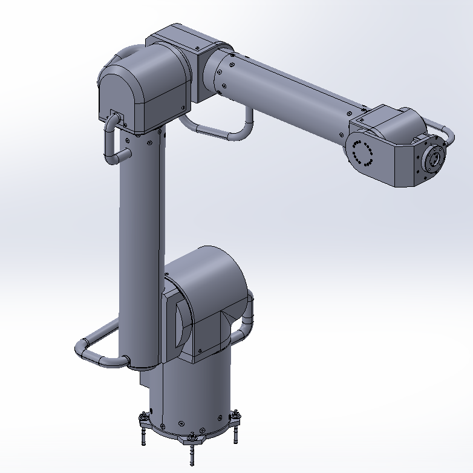

  

<h1 align="center">🛠️ HexaArm MEDIUM

    
    

### **Open Source 6-Axis Manipulator**
>
> The flagship mechanical platform of the Maker Series. Designed to bridge the gap between hobby projects and industrial reliability. Built with standard aluminum profiles and harmonic drives.
>
#### 🚧 Status: COMING SOON (Q2 2026)
*Release candidates are undergoing stress testing.*

---

#### 📐 Specifications
| Feature | Spec |
| :--- | :--- |
| **Payload** | 6 kg |
| **Reach** | 1100 - 1300 mm |
| **Drive Train** | Harmonic Drives (Sizes 14-32) |
| **Material** | CNC Aluminum / Extrusion |

#### 📂 Repository Contents (Roadmap)

**⚠️ NOTE:** This repository contains the **Mechanical Assembly** only. For the controller, see [HexaCore](https://github.com/HexaKinetica/HexaCore)

#### `/mechanical`
*   **CNC Parts:** DXF/STEP files for machining the aluminum skeleton.
*   **Joint Modules:** Assembly guides for the 6 actuator modules (Motor + Reducer + Encoder).
*   **Cable Chain:** Routing guides for internal cabling.

#### `/docs`
*   **Assembly Manual:** Step-by-step PDF guide.
*   **Sourcing Guide:** Links to recommended suppliers for motors and reducers (AliExpress / Direct OEM).

---

#### ⚡ Required Controller
To run this arm, you need the **HexaCore** cabinet.
👉 **Build the Controller:** [hexa-core-hardware](https://github.com/HexaKinetica/hexa-core-hardware)

---

**[HexaKinetica.com](https://hexakinetica.com)**
