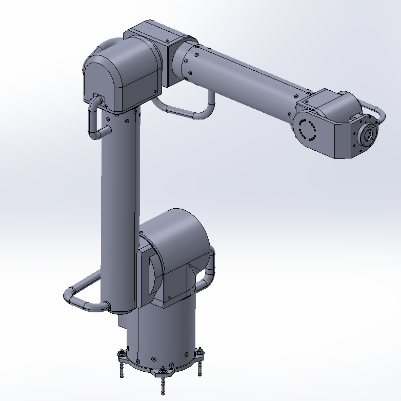

  

<h1 align="center">HexaArm Medium Pro</h1>

    
    

---

## Medium-Class Robot Arm Platform

**HexaArm Medium Pro** is the target medium-class robot arm platform of the HexaKinetica project.

It defines the next step after the Mini Maker \ Pro and Hybrid validation platforms: a larger robot arm architecture built around real mechanical design, motion control, controller hardware, and operator software.

This repository documents the design direction and system architecture of the Medium Pro platform.

---

## Project Status

**Status:** CAD ready / under development

The mechanical concept has been developed in CAD and is used as the reference direction for the next stage of the HexaKinetica platform.

This repository is currently an overview and development reference.
---

## Target Direction

HexaArm Medium Pro is being developed as a larger robot arm platform connected to the HexaKinetica control ecosystem.

The intended architecture includes:

- medium-class robot arm mechanics
- industrial servo-based actuation
- EtherCAT motion control
- external controller cabinet
- integration with HexaCore controller architecture
- integration with HexaStudio operator software
- CAD-driven development workflow

---

## Target Specifications

| Feature | Target |
|---|---|
| **Class** | Medium robot arm platform |
| **Payload** | ~6 kg target |
| **Reach** | ~1100–1300 mm target |
| **Actuation** | Industrial servo architecture |
| **Motion Control** | EtherCAT-based |
| **Controller** | External HexaCore cabinet |
| **Status** | CAD concept / under development |

Specifications may change during validation and prototype development.

---

## System Context

HexaArm Medium Pro is not developed as a standalone object. It is part of the wider HexaKinetica platform.

Related projects:

- **[HexaCore](https://github.com/hexakinetica/HexaCore)** — controller architecture
- **[HexaStudio](https://github.com/hexakinetica/HexaStudio)** — operator interface and simulation environment
- **[HexaMotion](https://github.com/hexakinetica/HexaMotion)** — motion control software foundation
- **[HexaArm Mini Maker](https://github.com/hexakinetica/HexaArm-Mini)** — open hardware desktop platform
- **[HexaArm Hybrid](https://github.com/hexakinetica/HexaArm-Hybrid)** — actuator and control validation platform

---

## Contact

#### contact@hexakinetica.com

GitHub:  [@hexakinetica](https://github.com/hexakinetica)  
YouTube: [@Hexakinetica](https://www.youtube.com/@Hexakinetica)
